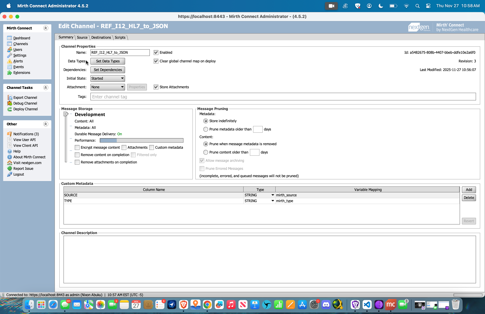
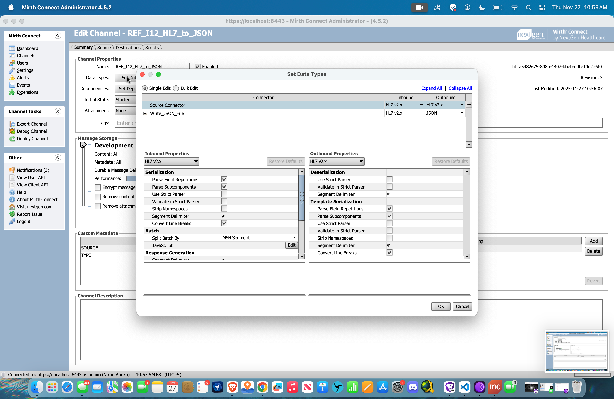
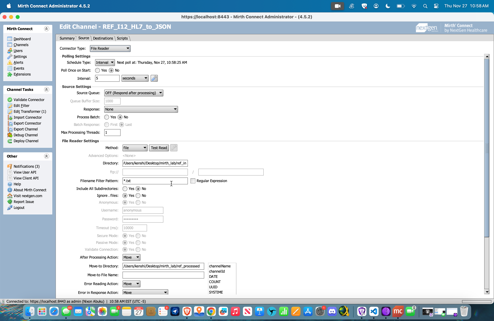
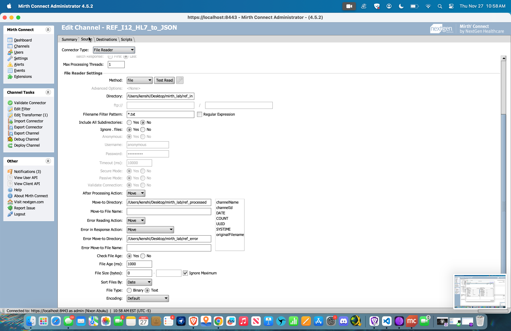
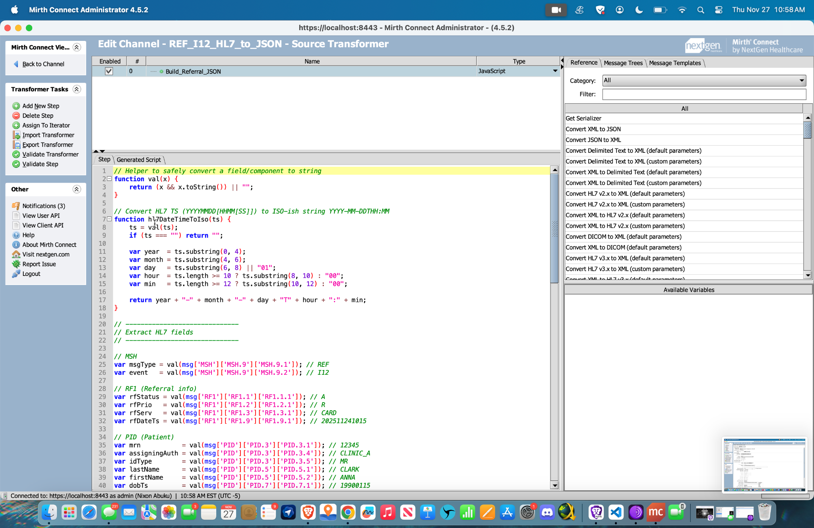
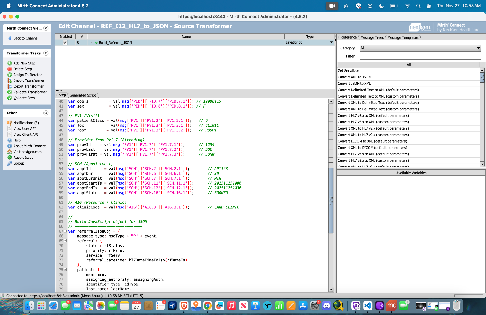
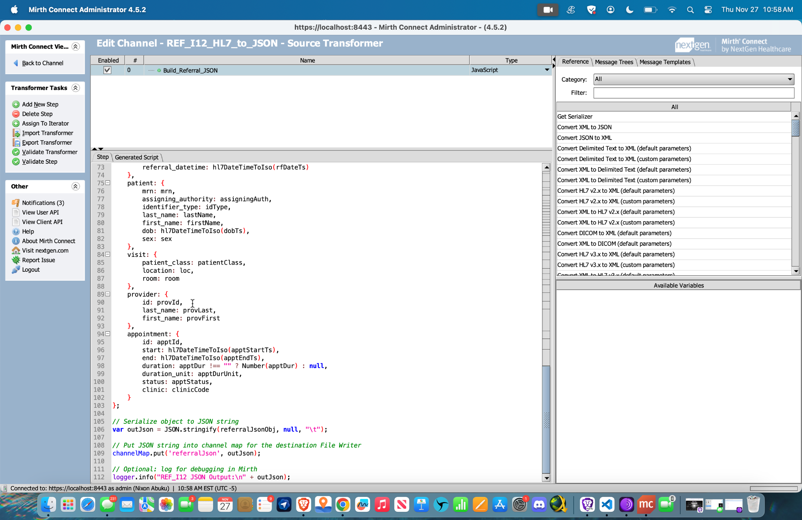
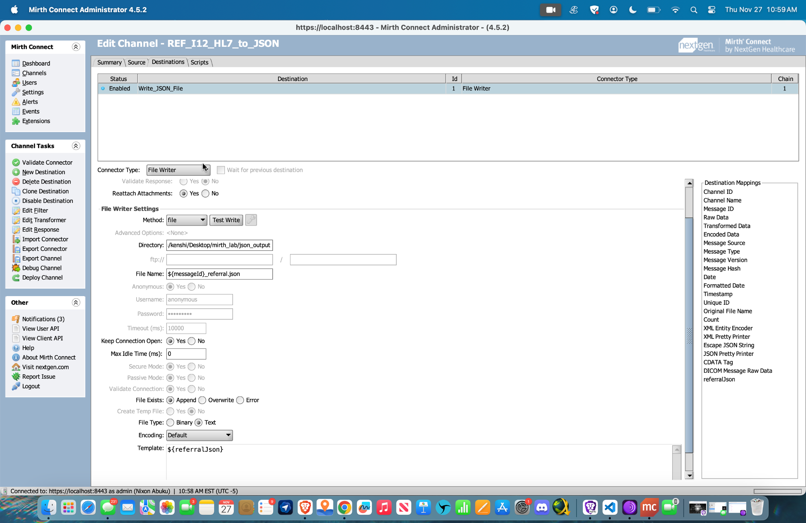

# REF_I12 HL7 → JSON Transformation Interface  
### A Mirth Connect Integration Project | Healthcare Interoperability Portfolio

This project demonstrates a full **end-to-end HL7 v2.x file-based interface** built in **Mirth Connect 4.5.2** that reads an inbound **REF_I12 referral message**, parses the HL7 segments, transforms the content into a **clean JSON object**, and writes the final JSON document to an output directory.

This is the type of workflow used every day in real hospitals and EHR integration teams.

---

## ⭐ Project Highlights (What Recruiters Should Notice)

- **Hands-on experience building a real HL7 interface (REF_I12 workflow).**
- **Strong Mirth Connect skills** (file reader, transformer, channel map, file writer, data types configuration).
- **Custom JavaScript transformation** to parse HL7 segments manually.
- **Accurate JSON output creation following clinical data structure**.
- **Real-world message processing workflow**:  
  ➝ Inbound directory → Parse HL7 → Transform → Output JSON → Move processed file  
- Demonstrates knowledge of:
  - HL7 v2.x referral messages  
  - PID, PV1, RF1, SCH, PRD/AIP, AIG segments  
  - Healthcare data normalization  
  - Error handling and message storage  
  - Clean portfolio documentation & reproducible interface design  

This project proves practical integration engineering ability—not just theory.

---

# 📌 **Project Overview**

### ⭐ Goal  
Convert an inbound **HL7 REF_I12 patient referral** message into a structured, readable **JSON file** that downstream systems can consume (analytics systems, scheduling APIs, referral management systems, etc.).

### ⭐ Technology Used  
- **Mirth Connect 4.5.2**
- JavaScript Transformer  
- File Reader / File Writer  
- HL7 v2.x  
- JSON Serialization

---

# 🏗 **Interface Architecture**

Inbound HL7 File (.txt)
↓
Mirth Connect File Reader
↓
HL7 v2.x Parsing (Data Types)
↓
JavaScript Transformer (custom mapping)
↓
JSON Object Created
↓
Channel Map stores JSON as “referralJson”
↓
Mirth File Writer outputs ${messageId}_referral.json
↓
Original HL7 file is moved to /ref_processed

yaml
Copy code

---

# 📁 Folder Structure

/
README.md
channel/
REF_I12_HL7_to_JSON.xml
sample_hl7/
REF_I12_inbound_referral_sample.txt
sample_json_output/
sample_output_referral.json
screenshots/
(all screenshot PNGs)
docs/
screenshots.md

yaml
Copy code

---

# 🧠 How It Works (Step-By-Step)
## 1. File Reader Summary


---

## 2. HL7 v2.x Data Types

Inbound data type = HL7 v2.x  
Outbound data type = JSON  
Strict parsing + segment delimiter handling

📸 **Screenshot:**  


---
## 3. File Reader Source Connector

- Watches directory:  
  `/Users/kenshi/Desktop/mirth_lab/ref_in`
- Accepts `.txt` files  
- Moves processed files to:  
  `/Users/kenshi/Desktop/mirth_lab/ref_processed`
- Moves errored files to:  
  `/Users/kenshi/Desktop/mirth_lab/ref_error`

📸 **Screenshot:**  




---


## 4. JavaScript Transformer

All HL7 REF_I12 fields (RF1, PID, PV1, SCH, PRD/AIP, AIG) are extracted and mapped into a structured JSON object.

JSON string is saved into the channel map under key: `referralJson`

Here is the Java script code used for the transformation:(./js_code_used/to_json.js)  
📸 **Screenshots:**  
  
  


---

## 5. File Writer Destination

- Outputs JSON to:  
  `/Users/kenshi/Desktop/mirth_lab/json_output`
- File name:  
  `${messageId}_referral.json`
- Template:  
  `${referralJson}`

📸 **Screenshot:**  


---

# 📄 Sample Output JSON

## 📄 Sample Output JSON

```json
{
  "message_type": "REF^I12",
  "referral": {
    "status": "A",
    "priority": "R",
    "service": "CARD",
    "referral_datetime": ""
  },
  "patient": {
    "mrn": "12345",
    "assigning_authority": "CLINIC_A",
    "identifier_type": "MR",
    "last_name": "CLARK",
    "first_name": "ANNA",
    "dob": "1990-01-15T00:00",
    "sex": "F"
  },
  "visit": {
    "patient_class": "O",
    "location": "CLINIC",
    "room": "ROOM1"
  },
  "provider": {
    "id": "1234",
    "last_name": "DOE",
    "first_name": "JOHN"
  },
  "appointment": {
    "id": "APT123",
    "start": "2025-11-25T10:30",
    "end": "",
    "duration": 30,
    "duration_unit": "MIN",
    "status": "BOOKED",
    "clinic": "CARD_CLINIC"
  }
}
```

📸 Screenshot:

🧩 Skills Demonstrated
HL7 v2.x comprehension (REF_I12 structure)

Mirth Connect channel design

JavaScript HL7 parsing

File-based interface architecture

JSON data modeling

Healthcare workflow understanding

Error handling in integration engines

Professional technical documentation

🚀 Why This Project Matters
This project simulates real-world work performed by:

HL7 Integration Engineers

Interface Analysts

Interoperability Specialists

Health Information Exchange (HIE) teams

EHR technical teams

It shows your ability to build, transform, and deliver clinical messages in a format that modern applications can use.

📦 Running the Project
Install Mirth Connect 4.5.2

Import channel XML from /channel/

Place HL7 sample file into your input directory

Deploy the channel

View JSON output in /json_output

📝 Author
Nixon Abuku
Healthcare Integration Engineer
New Jersey, USA
